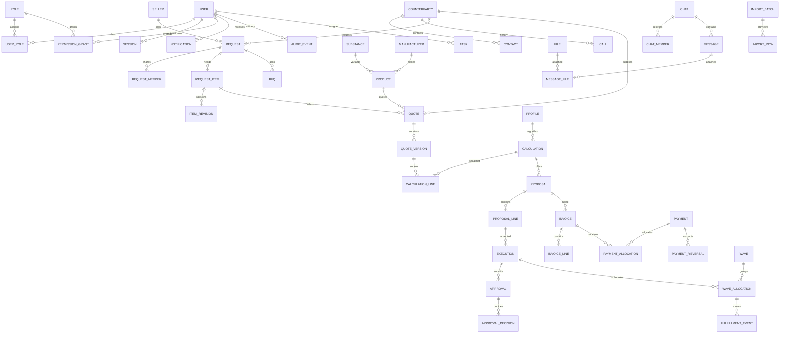

# Модель данных до реализации UI

Технический ключ всех сущностей UUID (строковое представление), created_at timestamptz, version int. Деньги numeric(24,8), количества numeric(24,6). У каждого изменения mutable объекта проверяется version.

Снимки расчётов, документов, редакций квот/потребностей, платёжные события и аудит не удаляются и не меняются штатным API. Связи документов ведут к конкретной версии; counterparty.details и seller.details копируются при выпуске. Общие суммы и количества защищаются транзакционными родительскими блокировками и проверками остатков; FK и CHECK защищают структуру. Персональные и ролевые разрешения хранятся отдельно. Поставщик — роль контрагента, производитель — отдельная сущность. Товар идентифицируется составным fingerprint, не поставщиком и не одним CAS.
